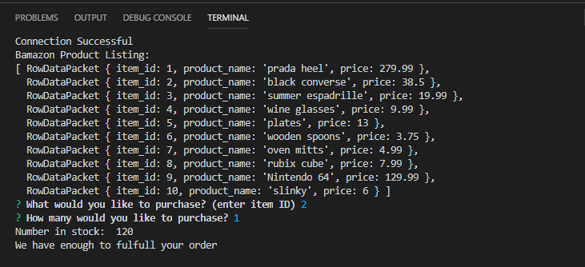
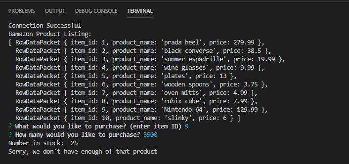

# Bamazon Web App
This simpliifed web application uses node.js to interact with mySql database to simulate an end user making purchases. The app first lists all 
of the products available for purchases. 
Secondly, the app prompts the user which products would they like to purchase as well as the quantity. After the user enters valid 
purchase information, they receive a success message stating that their purchase was successful.  If the quantity exceeds the amount
currently available, they receive a decline message and cannot complete the purchase.

## Screenshots

